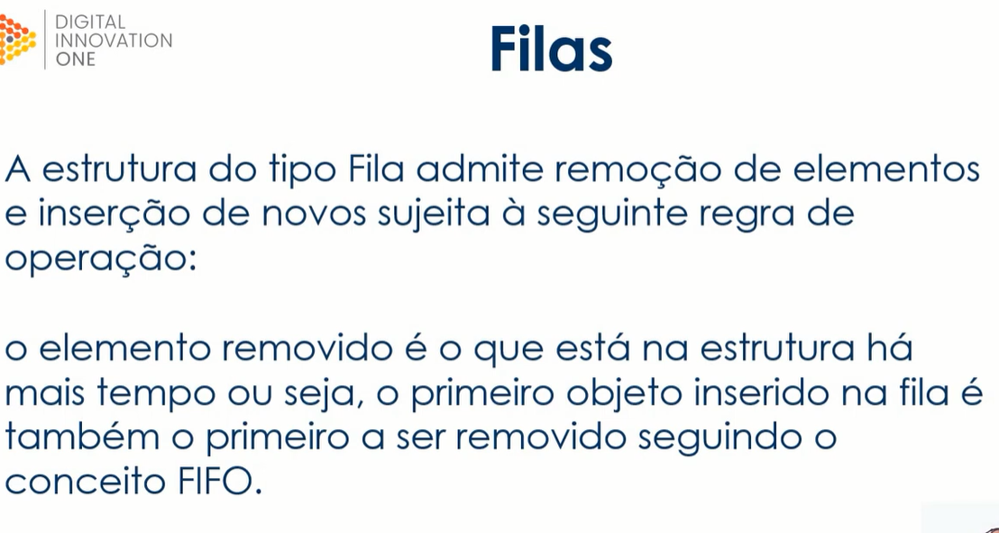
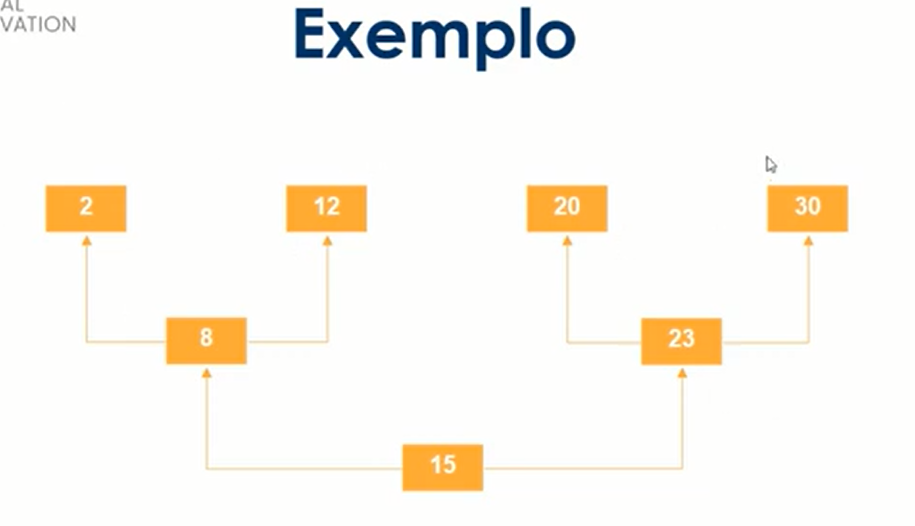
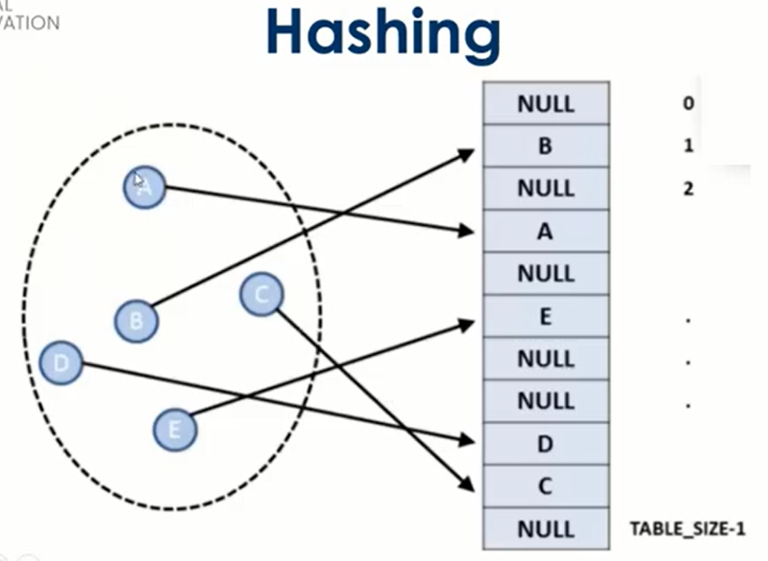
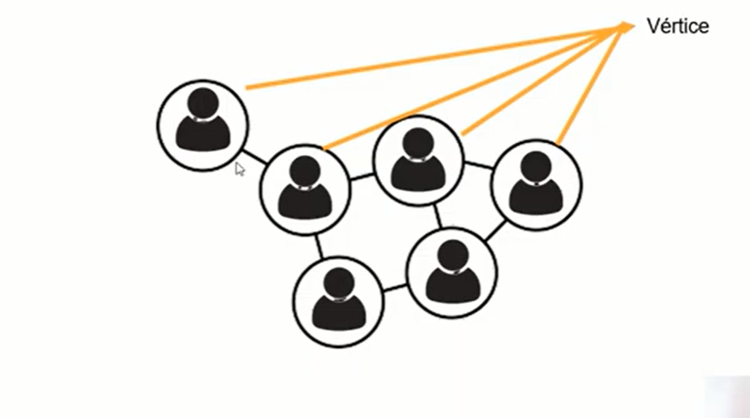
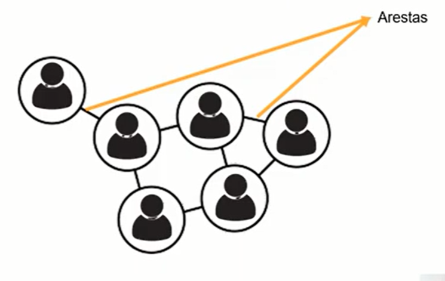

# Aprenda o que são Estrutura de Dados e Algoritmos

https://web.digitalinnovation.one/

Aprenda o que são estruturas de dados em um sistema, qual a importância dela e como trabalhar com o armazenamento dessas informações de forma ágil e otimizada.

## <a name="indice">Índice</a>

1. [Conceitos iniciais sobre estrutura de dados, arrays e registro](#parte1)     
2. [Entenda o que são Listas, Pilhas e Filas](#parte2)     
3. [Estruturas de dados do tipo Árvore, Tabela Hash e Grafos](#parte3)     
---


## <a name="parte1">1 - Conceitos iniciais sobre estrutura de dados, arrays e registro</a>

- Introdução e objetivos
- O que é estrutura de dados


- Vetores e matrizes


- O que são registros


- Certifique seu conhecimento

```
O que são vetores?
É uma variável que armazena outra variável do mesmo tipo.
É uma variável que armazena várias constantes do mesmo tipo.
É uma variável que armazena várias variáveis do mesmo tipo.
É uma variável que armazena várias variáveis de tipos diferentes.
É o inimigo de um desenho animado famoso.

R: É uma variável que armazena várias variáveis do mesmo tipo.
```

```
Em um algoritmo, como podemos acessar um campo de um registro?
Utilizando estrutura condicional.
Utilizando o símbolo de ponto (.). Ex.: livro.nome.
Utilizando um vetor.
Não Podemos pois os campos são restritos.
Utilizando a estrutura de laço infinito.

R: Utilizando o símbolo de ponto (.). Ex.: livro.nome.
```

```
O que é uma matriz?
É uma variável que armazena outra variável do mesmo tipo.
É um vetor que possui duas ou mais dimensões (vetor de vetores).
É uma variável que armazena várias variáveis do mesmo tipo.
É uma variável que armazena várias variáveis de tipos diferentes.
É uma variável que armazena várias constantes do mesmo tipo.

R: É um vetor que possui duas ou mais dimensões (vetor de vetores).
```

```
O que é uma estrutura do tipo Registro?
É uma estrutura que fornece um formato tipado para armazenar informações em memória.
É uma estrutura que fornece um formato especializado para armazenar informações em memória.
Estrutura que armazena registros de dados em memória.
É uma estrutura que fornece um formato errado para armazenar informações em memória.
Nenhuma das alternativas.

R: É uma estrutura que fornece um formato especializado para armazenar informações em memória.
```

```
O que é um algoritmo?
Um conjunto de instruções estruturadas e ordenadas, seu objetivo é realizar uma tarefa ou operação específica.
Estrutura do tipo algoritmo de arvore binária e recursiva
Um conjunto de instruções estruturadas e sem ordem, seu objetivo é realizar uma tarefa ou operação específica.
Estrutura de dados ordenada, seu objetivo é realizar uma tarefa ou operação específica.
Nenhuma das alternativas.

R: Um conjunto de instruções estruturadas e ordenadas, seu objetivo é realizar uma tarefa ou operação específica.
```

```
Quais as principais estruturas de dados?
Nós, Axiomas, Vértices, Folhas e Tuplas.
Substituição, Explosão, Dependências, Relações e Nós.
Trilhas, Setores e Clusters.
Vetores e Matrizes, Registro, Lista, Pilha, Fila, Árvore, Tabela Hash e Grafos.
Vetores, Raízes, Filhas, Tuplas e Data.

R: Vetores e Matrizes, Registro, Lista, Pilha, Fila, Árvore, Tabela Hash e Grafos.
```

```
Quais operações básicas devemos saber em uma estrutura de dados?
Excluir e inserir dados.
Inserir, excluir, localizar dados, percorrer itens e classificar dados.
Manipular, remover, procurar e gerar dados.
Inserir e manipular dados.
Todas as alternativas estão corretas.

R: Inserir, excluir, localizar dados, percorrer itens e classificar dados.
```

```
Qual a diferença entre os arrays e a estrutura registro?
Arrays só aceitam caracteres.
Enquanto Arrays nos permitem armazenar vários dados de um único tipo de dados, o recurso de Registro nos permite armazenar mais de um tipo de dado.
Enquanto Arrays nos permitem armazenar vários dados de vários tipos, o recurso de Registro nos permite armazenar somente um tipo de dado.
Nenhuma.
Registros aceitam somente números.

R: Enquanto Arrays nos permitem armazenar vários dados de um único tipo de dados, o recurso de Registro nos permite armazenar mais de um tipo de dado.
```

```
O que é estrutura de dados?
Estrutura para desenvolver sites.
Estrutura organizada de dados na memória de um computador ou em qualquer dispositivo de armazenamento, de forma que os dados possam ser utilizados de forma correta.
Estrutura para desenvolver sistemas.
Nenhuma das alternativas.
Estrutura implantada na memória de um computador , de forma que os dados possam ser utilizados de forma inversa.

R: Estrutura organizada de dados na memória de um computador ou em qualquer dispositivo de armazenamento, de forma que os dados possam ser utilizados de forma correta.
```

```
Qual outro nome dado a vetores e matrizes?
Me amarrei.
Delay.
Array.
Marrei.
Arrey.

R: Array.
```

[Voltar ao Índice](#indice)

---


## <a name="parte2">2 - Entenda o que são Listas, Pilhas e Filas</a>

- Introdução e objetivos
- O que são listas


- O que são pilhas


- O que são filas




- Certifique seu conhecimento

```
Qual a diferença das listas ligadas para as duplamente ligadas?
As duas estruturas são iguais.
Nenhuma.
Uma estrutura vai para um lado, a outra vai para o outro e vice e versa.
A Lista Ligada é bidirecional e a Duplamente Ligada é unidirecional.
A lista Ligada é unidirecional e a Duplamente Ligada é bidirecional.

R: A lista Ligada é unidirecional e a Duplamente Ligada é bidirecional.
```

```
Qual o critério utilizado pela pilha tipo LIFO?
O primeiro elemento a ser retirado é o último que tiver sido inserido.
O segundo elemento a ser retirado é o primeiro que tiver sido inserido.
O elemento do meio é o primeiro que tiver sido inserido.
O terceiro elemento a ser retirado é o primeiro que tiver sido inserido.
O primeiro elemento a ser retirado é o primeiro que tiver sido inserido.

R: O primeiro elemento a ser retirado é o último que tiver sido inserido.
```

```
Quais as siglas corretas dos dois tipos de pilhas existentes (tanto em inglês como português)?
Nenhuma das alternativas.
RICO (UEPS) e CHICO (COCA).
TUPLA (TEPS) e SUPLA(ROCK).
RIFO (REPS) e RIFA (PEPSI).
LIFO (UEPS) e FIFO (PEPS).

R: LIFO (UEPS) e FIFO (PEPS).
```

```
Quais os dois tipos conhecidos de estruturas do tipo Lista?
Passadas e Duplamente Passadas.
Arvores e Nós.
Ligadas e Duplamente Ligadas.
Fuzzing e Digitadas.
Tuneladas e Ligadas.

R: Ligadas e Duplamente Ligadas.
```

```
Para que serve a Estrutura do tipo Pilha?
É uma estrutura de dados que serve como uma subtração de elementos e permite o acesso a somente um item de dados armazenado.
Para nenhuma aplicação sequer.
É uma estrutura de dados que serve como uma soma de índices e permite o acesso a todos os dados armazenados.
É uma estrutura qualquer como as outras.
É uma estrutura de dados que serve como uma coleção de elementos, e permite o acesso a somente um item de dados armazenado.

R: É uma estrutura de dados que serve como uma coleção de elementos, e permite o acesso a somente um item de dados armazenado.
```

```
Qual conceito da estrutura do tipo Pilha é também utilizado na estrutura Fila?
Grafo.
Vetor.
LIFO.
Nó.
FIFO.

R: FIFO

```

```
Qual o critério utilizado pela pilha tipo FIFO?
O terceiro elemento a ser retirado é o primeiro que tiver sido inserido.
O elemento do meio é o primeiro que tiver sido inserido.
O último elemento a ser retirado é o primeiro que tiver sido inserido.
O primeiro elemento a ser retirado é o primeiro que tiver sido inserido.
O segundo elemento a ser retirado é o primeiro que tiver sido inserido.

R: O primeiro elemento a ser retirado é o primeiro que tiver sido inserido.
```

```
Como é feito o acesso aos itens de uma pilha?
O acesso aos itens de uma pilha é irrestrito – todos os itens podem ser lido ou removidos de uma só vez.
O acesso aos itens de uma pilha é restrito – somente um item pode ser lido ou removido por vez.
O acesso aos itens de uma pilha é idêntico a um vetor.
O acesso aos itens de uma pilha é irrestrito - somente um item pode ser lido ou removido por vez.
O acesso aos itens de uma pilha é restrito –todos os itens podem ser lido ou removidos de uma só vez.

R: O acesso aos itens de uma pilha é restrito – somente um item pode ser lido ou removido por vez.

```

```
Qual a regra utilizada em uma estrutura do tipo Fila?
O elemento removido é o primeiro da estrutura.
O elemento removido é o que está na estrutura há mais tempo.
Todas as alternativas estão corretas.
O elemento removido é o segundo da estrutura.
O elemento removido é o que está na estrutura há menos tempo.

R: O elemento removido é o que está na estrutura há mais tempo.
```

[Voltar ao Índice](#indice)

---


## <a name="parte3">3 - Estruturas de dados do tipo Árvore, Tabela Hash e Grafos</a>

- Introdução e objetivos
- O que são árvores




- O que são tabelas hash





- O que são grafos






- Certifique seu conhecimento

```
Quais os elementos existentes na estrutura árvore?
Raiz e galhos
Fotossíntese e protossíntese.
Tronco e folhas.
Raiz e nós (folhas).
Ramos e sulcos.

R: Raiz e nós (folhas).

```

```
Qual o nome da representação dos objetos em um grafo?
Matrizes ou Vetores.
Vértices ou Nós.
Arrays ou Arreys.
Dobra ou Vértice.
Nenhuma das alternativas.

R: Vértices ou Nós.
```

```
Qual o nome da representação de um relacionamento em um grafo?
Folhas.
Arestas.
Nós.
Chaves.
Linha.

R: Arestas.
```

```
De que forma ficam estruturados os elementos em uma Tabela Hash?
Não ordenada.
Alfabética.
Numérica.
Ordenada.
Inversa.

R: Não ordenada.
```

```
O que é uma estrutura do tipo Árvore?
É uma estrutura de dados que organiza seus elementos de forma hierárquica.
É uma estrutura de dados que organiza seus elementos de forma repetida.
É uma estrutura de dados que organiza seus elementos de forma desordenada.
É uma estrutura de dados que organiza seus elementos de forma duplicada.
É uma estrutura de dados que organiza seus elementos de forma ordenada.

R: É uma estrutura de dados que organiza seus elementos de forma hierárquica.
```

```
Quais os nomes dos elementos existentes na estrutura Tabela Hash?
Chaves e índices.
Chaves e valores.
Índices e cadeados.
Índices e valores.
Chaves e cadeados.

R: Chaves e valores.
```

```
O que é uma estrutura do tipo Tabela Hash?
É uma estrutura de dados especial, que associa chaves de pesquisa a valores.
É uma estrutura de dados especial, que contem linhas e colunas.
É uma estrutura de dados especial, similar a uma tabela.
É uma estrutura de dados especial, similar a uma planilha.
É uma estrutura de dados especial, similar a lista ligada do tipo FIFO.

R: É uma estrutura de dados especial, que associa chaves de pesquisa a valores.
```

```
O que são grafos?
São estruturas que permitem programar a relação entre índices.
Garfos.
São estruturas que permitem programar a relação entre objetos.
São estruturas que permitem programar a relação entre valores.
São estruturas que permitem criar uma algoritmo com vários algoritmos.

R: São estruturas que permitem programar a relação entre objetos.
```

```
Quais os outros nomes dados a estrutura Tabela Hash?
Tabela ou Planilha.
Tabela de dispersão ou espalhada.
Tabela de dispersão ou Tabela de espalhamento.
Tabela de repressão ou Tabela espalha tudo.
Tabela Garming ou Tabela de Dados.

R: Tabela de dispersão ou Tabela de espalhamento.
```

```
Qual o nome da função que causa o espalhamento de dados numa Tabela Hash?
Hash.
Hashing.
Hashear.
Espalhar.
Nenhuma das alternativas.

R: Hashing.

```

[Voltar ao Índice](#indice)

---

